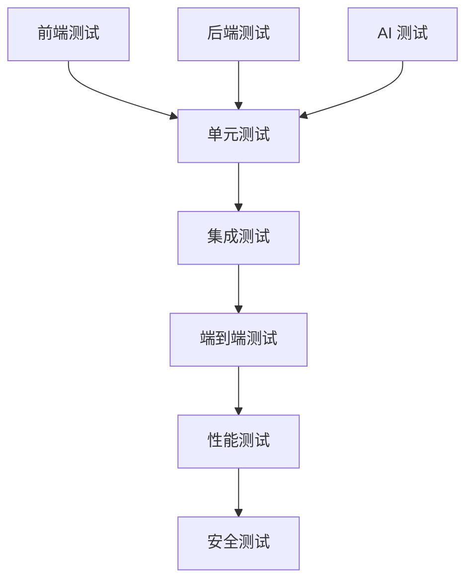

# AI 内容生产平台 - 代理间协调文档

## 协调会议记录
**时间**: 2026-02-14 19:30 GMT+8  
**目的**: 确保各代理工作对齐，解决接口问题  
**参与代理**: 所有6个专业代理 + Supervisor

## 关键决策对齐

### 1. 技术栈最终确认
| 领域 | 技术栈 | 负责人 | 状态 |
|------|--------|--------|------|
| 前端 | Next.js 14 + TypeScript + Tailwind + shadcn/ui | Frontend Developer | ✅ 确认 |
| 后端 | FastAPI + PostgreSQL + Redis + Celery | Backend Architect | ✅ 确认 |
| AI 服务 | 混合模型 (Adobe Firefly + Runway + Udio + OpenAI) | AI Integration Specialist | 🔄 调研中 |
| 测试 | Jest + Playwright + pytest + Lighthouse | Test & Quality Agent | ✅ 确认 |
| 部署 | Docker + Kubernetes + AWS/GCP | Backend Architect | ✅ 确认 |

### 2. 接口规范对齐

#### API 网关设计:
- **统一入口**: `/api/v1`
- **认证方式**: JWT Bearer Token
- **响应格式**: 统一 JSON 结构
- **错误处理**: 标准 HTTP 状态码 + 错误信息

#### 前端-后端接口:
```typescript
// 由 Backend Architect 提供，Frontend Developer 实现
interface APIResponse<T> {
  success: boolean;
  data: T;
  error: APIError | null;
  meta: {
    request_id: string;
    timestamp: string;
    pagination?: PaginationInfo;
  };
}
```

#### AI 服务接口:
```python
# 由 AI Integration Specialist 设计，Backend Architect 实现
class AIGenerationRequest:
    prompt: str
    parameters: Dict[str, Any]
    callback_url: Optional[str]
    
class AIGenerationResponse:
    task_id: str
    status: Literal["pending", "processing", "completed", "failed"]
    estimated_time: Optional[int]
    result_urls: Optional[List[str]]
```

### 3. 数据模型对齐

#### 核心实体关系:
```
User (1) -- (n) Project (1) -- (n) GenerationTask
Project (1) -- (n) MediaFile
GenerationTask (1) -- (n) MediaFile
```

#### 字段命名规范:
- **数据库字段**: snake_case (user_id, created_at)
- **API 字段**: camelCase (userId, createdAt)
- **前端变量**: camelCase (userId, createdAt)
- **配置文件**: kebab-case (user-config, api-settings)

### 4. 设计系统对齐

#### 设计令牌 (Design Tokens):
```css
/* 由 UX/UI Designer 定义，Frontend Developer 实现 */
:root {
  /* 颜色系统 */
  --color-primary: #3B82F6;
  --color-secondary: #8B5CF6;
  --color-success: #10B981;
  --color-warning: #F59E0B;
  --color-danger: #EF4444;
  
  /* 间距系统 */
  --spacing-xs: 0.25rem;  /* 4px */
  --spacing-sm: 0.5rem;   /* 8px */
  --spacing-md: 1rem;     /* 16px */
  --spacing-lg: 1.5rem;   /* 24px */
  --spacing-xl: 2rem;     /* 32px */
  
  /* 字体系统 */
  --font-family-sans: 'Inter', system-ui, sans-serif;
  --font-family-mono: 'JetBrains Mono', monospace;
  --font-size-sm: 0.875rem;  /* 14px */
  --font-size-base: 1rem;    /* 16px */
  --font-size-lg: 1.125rem;  /* 18px */
  --font-size-xl: 1.25rem;   /* 20px */
}
```

### 5. AI 模型集成对齐

#### 模型优先级矩阵:
| 功能 | 首选模型 | 备选模型 | 质量要求 | 成本限制 |
|------|----------|----------|----------|----------|
| 图像生成 | Adobe Firefly | Stable Diffusion 3 | 高清，风格多样 | $0.05/张 |
| 视频生成 | Runway Gen-2 | Pika Labs | 流畅，1080p | $0.10/秒 |
| 音频生成 | Udio | MusicGen | 高音质，风格控制 | $0.03/秒 |
| 文档解析 | GPT-4 Vision | Claude 3 | 准确率 >95% | $0.01/页 |

#### 集成模式:
1. **同步调用**: 简单任务，快速响应 (<5秒)
2. **异步队列**: 复杂任务，后台处理
3. **批量处理**: 多个相似任务合并
4. **缓存复用**: 相同输入复用结果

### 6. 测试策略对齐

#### 测试层级:


#### 测试数据管理:
- **单元测试**: Mock 数据和函数
- **集成测试**: 测试数据库 + 模拟服务
- **E2E 测试**: 真实环境 + 测试账号
- **性能测试**: 生产类似数据量

### 7. 开发工作流对齐

#### Git 分支策略:
```
main (保护分支)
├── develop (集成分支)
│   ├── feature/ai-image-generation
│   ├── feature/video-editor
│   ├── feature/user-authentication
│   └── hotfix/login-issue
├── release/v1.0.0
└── hotfix/production-issue
```

#### 代码审查流程:
1. 开发者在 feature 分支工作
2. 完成功能后创建 Pull Request
3. 至少2个审查者批准
4. 所有测试通过
5. 合并到 develop 分支

### 8. 部署策略对齐

#### 环境配置:
| 环境 | 目的 | 数据库 | AI 模型 | 监控 |
|------|------|--------|---------|------|
| 开发 | 本地开发 | Docker | Mock/免费版 | 基础 |
| 测试 | 功能测试 | 独立实例 | 测试API密钥 | 完整 |
| 预生产 | 集成测试 | 生产类似 | 生产API密钥 | 完整 |
| 生产 | 用户使用 | 高可用集群 | 生产API密钥 | 企业级 |

### 9. 监控和告警对齐

#### 关键指标:
- **业务指标**: 用户数、生成次数、收入
- **性能指标**: API响应时间、错误率、吞吐量
- **AI 指标**: 生成成功率、平均耗时、成本
- **系统指标**: CPU、内存、磁盘、网络

#### 告警阈值:
- API 错误率 > 1% (警告) > 5% (严重)
- 响应时间 P95 > 200ms (警告) > 500ms (严重)
- AI 生成失败率 > 10% (警告) > 20% (严重)
- 系统资源 > 80% (警告) > 90% (严重)

### 10. 下一步协调计划

#### 立即协调 (19:30-19:45):
1. Backend Architect ↔ Frontend Developer: API 接口最终确认
2. UX/UI Designer ↔ Frontend Developer: 设计系统实现细节
3. AI Integration Specialist ↔ Backend Architect: AI 服务接口定义

#### 短期协调 (今晚):
1. 所有代理: 第一阶段成果汇总
2. 第二阶段任务分配协调
3. 接口联调计划制定

#### 中期协调 (明天):
1. 技术架构评审会议
2. 开发环境搭建协调
3. 测试策略评审会议

## 问题与解决方案

### 当前识别的问题:
1. **AI API 成本不确定性** 
   - 解决方案: 建立成本监控和预警机制
   - 负责人: AI Integration Specialist

2. **前端-后端接口版本管理**
   - 解决方案: 采用 API 版本控制 (v1, v2)
   - 负责人: Backend Architect + Frontend Developer

3. **测试数据一致性**
   - 解决方案: 建立共享测试数据仓库
   - 负责人: Test & Quality Agent

### 依赖关系管理:
- Frontend Developer 依赖 UX/UI Designer 的设计输出
- Backend Architect 依赖 Product Planner 的功能需求
- AI Integration Specialist 依赖所有代理的技术决策
- Test & Quality Agent 依赖所有代理的实现

## 沟通渠道

### 实时沟通:
- **Slack/Teams 频道**: #ai-platform-dev
- **每日站会**: 09:30 AM GMT+8
- **周会**: 每周一 14:00 GMT+8

### 文档协作:
- **设计文档**: Figma + Notion
- **技术文档**: GitHub Wiki + Markdown
- **API 文档**: Swagger/Redoc
- **项目计划**: Jira/Linear

### 进度同步:
- **每日进度报告**: 18:00 GMT+8
- **每周总结**: 周五 17:00 GMT+8
- **里程碑评审**: 每个阶段完成后

## 紧急情况处理

### 升级路径:
1. 代理内部解决 (1小时内)
2. 代理间协调解决 (2小时内)
3. Supervisor Agent 介入 (4小时内)
4. 项目负责人决策 (8小时内)

### 回滚策略:
- **代码回滚**: Git revert 到稳定版本
- **数据回滚**: 数据库备份恢复
- **配置回滚**: 配置版本管理
- **部署回滚**: 蓝绿部署切换

---

**最后更新**: 2026-02-14 19:30 GMT+8  
**下次协调会议**: 19:45 GMT+8 (第一阶段中期评审)  
**协调负责人**: Supervisor Agent