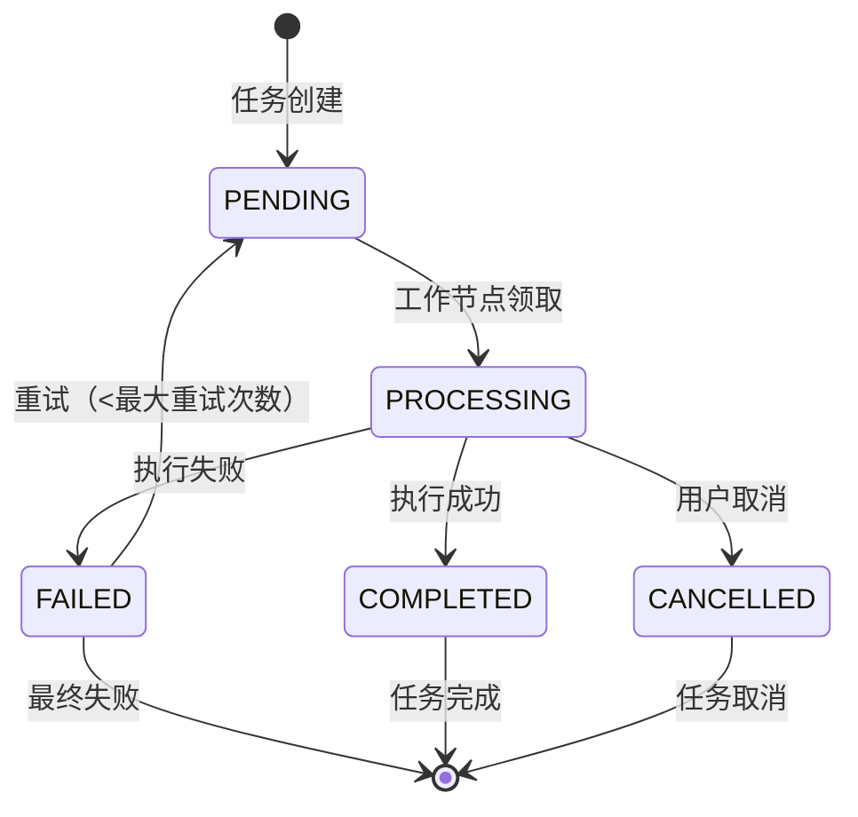

# AI 服务集成架构设计

## 1. AI 服务网关设计

### 1.1 网关架构

```
┌─────────────────────────────────────────────────────────┐
│                    AI 服务网关 (AI Gateway)              │
├─────────────────────────────────────────────────────────┤
│  ┌─────────────┐ ┌─────────────┐ ┌─────────────┐      │
│  │  请求路由   │ │  协议适配   │ │  负载均衡   │      │
│  └─────────────┘ └─────────────┘ └─────────────┘      │
├─────────────────────────────────────────────────────────┤
│  ┌─────────────┐ ┌─────────────┐ ┌─────────────┐      │
│  │  模型管理   │ │  成本控制   │ │  监控统计   │      │
│  └─────────────┘ └─────────────┘ └─────────────┘      │
├─────────────────────────────────────────────────────────┤
│  ┌─────────────┐ ┌─────────────┐ ┌─────────────┐      │
│  │  缓存层     │ │  重试机制   │ │  熔断器     │      │
│  └─────────────┘ └─────────────┘ └─────────────┘      │
└─────────────────────────────────────────────────────────┘
                              │
         ┌────────────────────┼────────────────────┐
         │                    │                    │
┌────────▼────────┐ ┌────────▼────────┐ ┌────────▼────────┐
│  OpenAI 适配器  │ │ Anthropic适配器 │ │  自研模型适配器 │
└─────────────────┘ └─────────────────┘ └─────────────────┘
```

### 1.2 核心功能模块

#### 1.2.1 请求路由
- **智能路由**：根据模型类型、成本、延迟选择最优提供商
- **故障转移**：主提供商失败时自动切换到备用
- **地理位置路由**：选择最近的数据中心

#### 1.2.2 协议适配
- **统一接口**：标准化所有AI服务的输入输出格式
- **协议转换**：REST ↔ gRPC ↔ WebSocket
- **参数映射**：不同模型参数的标准化映射

#### 1.2.3 负载均衡
- **轮询调度**：均匀分配请求到多个实例
- **加权轮询**：根据实例性能分配权重
- **最少连接**：选择当前连接数最少的实例

#### 1.2.4 模型管理
```yaml
# 模型配置示例
models:
  gpt-4:
    providers:
      - name: openai
        endpoint: https://api.openai.com/v1
        api_key_env: OPENAI_API_KEY
        priority: 1
        cost_per_1k_tokens:
          input: 0.03
          output: 0.06
      - name: azure-openai
        endpoint: https://{resource}.openai.azure.com
        api_key_env: AZURE_OPENAI_API_KEY
        priority: 2
        cost_per_1k_tokens:
          input: 0.02
          output: 0.04
  
  claude-3-opus:
    providers:
      - name: anthropic
        endpoint: https://api.anthropic.com/v1
        api_key_env: ANTHROPIC_API_KEY
        priority: 1
        cost_per_1k_tokens:
          input: 0.015
          output: 0.075
```

### 1.3 网关技术实现

```go
// AI Gateway 核心接口
type AIGateway interface {
    // 文本生成
    GenerateText(ctx context.Context, req *TextGenerationRequest) (*TextGenerationResponse, error)
    
    // 图像生成
    GenerateImage(ctx context.Context, req *ImageGenerationRequest) (*ImageGenerationResponse, error)
    
    // 代码生成
    GenerateCode(ctx context.Context, req *CodeGenerationRequest) (*CodeGenerationResponse, error)
    
    // 语音生成
    GenerateSpeech(ctx context.Context, req *SpeechGenerationRequest) (*SpeechGenerationResponse, error)
    
    // 模型列表
    ListModels(ctx context.Context) ([]ModelInfo, error)
    
    // 使用统计
    GetUsage(ctx context.Context, userID string) (*UsageStats, error)
}

// 负载均衡器接口
type LoadBalancer interface {
    SelectProvider(model string, providers []ProviderConfig) (ProviderConfig, error)
    UpdateProviderStats(providerID string, success bool, latency time.Duration)
}

// 成本计算器
type CostCalculator interface {
    CalculateCost(model string, inputTokens, outputTokens int) (decimal.Decimal, error)
    GetUserBalance(userID string) (decimal.Decimal, error)
    DeductCost(userID string, amount decimal.Decimal) error
}
```

## 2. 异步任务处理流程

### 2.1 任务处理架构

```
┌─────────────┐    ┌─────────────┐    ┌─────────────┐
│  任务提交   │───▶│  任务队列   │───▶│  工作节点   │
└─────────────┘    └─────────────┘    └─────────────┘
                                               │
┌─────────────┐    ┌─────────────┐    ┌───────▼───────┐
│  结果存储   │◀───│  任务执行   │◀───│  AI服务调用  │
└─────────────┘    └─────────────┘    └───────────────┘
        │                                          │
┌───────▼───────┐                        ┌────────▼────────┐
│  通知服务     │                        │  监控和日志    │
└───────────────┘                        └─────────────────┘
```

### 2.2 任务状态机



### 2.3 任务队列设计

```go
// 任务队列接口
type TaskQueue interface {
    // 提交任务
    Enqueue(task *GenerationTask) error
    
    // 获取任务
    Dequeue(workerID string) (*GenerationTask, error)
    
    // 更新任务状态
    UpdateStatus(taskID string, status TaskStatus, result interface{}) error
    
    // 取消任务
    Cancel(taskID string) error
    
    // 获取任务状态
    GetStatus(taskID string) (*TaskStatusInfo, error)
}

// 任务优先级队列实现
type PriorityTaskQueue struct {
    highPriority   chan *GenerationTask
    normalPriority chan *GenerationTask
    lowPriority    chan *GenerationTask
}

func (q *PriorityTaskQueue) Enqueue(task *GenerationTask) error {
    switch task.Priority {
    case PriorityHigh:
        select {
        case q.highPriority <- task:
            return nil
        default:
            // 队列满，降级处理
            return q.normalPriority <- task
        }
    case PriorityNormal:
        q.normalPriority <- task
    case PriorityLow:
        q.lowPriority <- task
    }
    return nil
}
```

### 2.4 工作节点设计

```go
// 工作节点
type Worker struct {
    ID          string
    Queue       TaskQueue
    Gateway     AIGateway
    Concurrency int
    StopChan    chan struct{}
}

func (w *Worker) Start() {
    for i := 0; i < w.Concurrency; i++ {
        go w.processTasks()
    }
}

func (w *Worker) processTasks() {
    for {
        select {
        case <-w.StopChan:
            return
        default:
            task, err := w.Queue.Dequeue(w.ID)
            if err != nil {
                time.Sleep(1 * time.Second)
                continue
            }
            
            // 执行任务
            result, err := w.executeTask(task)
            if err != nil {
                w.Queue.UpdateStatus(task.ID, StatusFailed, err.Error())
            } else {
                w.Queue.UpdateStatus(task.ID, StatusCompleted, result)
            }
        }
    }
}

func (w *Worker) executeTask(task *GenerationTask) (interface{}, error) {
    ctx, cancel := context.WithTimeout(context.Background(), 5*time.Minute)
    defer cancel()
    
    switch task.Type {
    case TaskTypeText:
        return w.Gateway.GenerateText(ctx, task.Request)
    case TaskTypeImage:
        return w.Gateway.GenerateImage(ctx, task.Request)
    case TaskTypeCode:
        return w.Gateway.GenerateCode(ctx, task.Request)
    default:
        return nil, fmt.Errorf("unsupported task type: %s", task.Type)
    }
}
```

## 3. 模型路由和负载均衡

### 3.1 路由策略

#### 3.1.1 基于成本的策略
```go
type CostBasedRouter struct {
    providers map[string]ProviderStats
}

func (r *CostBasedRouter) SelectProvider(model string) (string, error) {
    var bestProvider string
    var bestCost float64 = math.MaxFloat64
    
    for providerID, stats := range r.providers {
        if stats.Model == model && stats.Available {
            cost := r.calculateEffectiveCost(stats)
            if cost < bestCost {
                bestCost = cost
                bestProvider = providerID
            }
        }
    }
    
    if bestProvider == "" {
        return "", errors.New("no available provider for model")
    }
    
    return bestProvider, nil
}

func (r *CostBasedRouter) calculateEffectiveCost(stats ProviderStats) float64 {
    // 考虑基础成本、延迟惩罚、错误率惩罚
    baseCost := stats.CostPerToken
    latencyPenalty := stats.AvgLatency * 0.001 // 每毫秒增加0.001成本
    errorPenalty := stats.ErrorRate * 10.0    // 错误率增加成本
    
    return baseCost + latencyPenalty + errorPenalty
}
```

#### 3.1.2 基于性能的策略
```go
type PerformanceBasedRouter struct {
    providers map[string]ProviderStats
}

func (r *PerformanceBasedRouter) SelectProvider(model string) (string, error) {
    var candidates []ProviderCandidate
    
    for providerID, stats := range r.providers {
        if stats.Model == model && stats.Available {
            score := r.calculateScore(stats)
            candidates = append(candidates, ProviderCandidate{
                ID:    providerID,
                Score: score,
            })
        }
    }
    
    if len(candidates) == 0 {
        return "", errors.New("no available provider for model")
    }
    
    // 按分数排序，选择最高分
    sort.Slice(candidates, func(i, j int) bool {
        return candidates[i].Score > candidates[j].Score
    })
    
    return candidates[0].ID, nil
}

func (r *PerformanceBasedRouter) calculateScore(stats ProviderStats) float64 {
    // 分数 = 100 - (延迟分数 + 错误率分数 + 成本分数)
    latencyScore := math.Min(stats.AvgLatency/100, 30) // 最大30分
    errorScore := stats.ErrorRate * 50                 // 最大50分
    costScore := stats.CostPerToken * 1000            // 每token成本*1000
    
    return 100 - (latencyScore + errorScore + costScore)
}
```

### 3.2 负载均衡算法

#### 3.2.1 加权轮询
```go
type WeightedRoundRobin struct {
    providers []ProviderWeight
    current   int
    gcd       int
    maxWeight int
    i         int
    cw        int
}

func (w *WeightedRoundRobin) Next() string {
    for {
        w.i = (w.i + 1) % len(w.providers)
        if w.i == 0 {
            w.cw = w.cw - w.gcd
            if w.cw <= 0 {
                w.cw = w.maxWeight
                if w.cw == 0 {
                    return ""
                }
            }
        }
        
        if w.providers[w.i].Weight >= w.cw {
            return w.providers[w.i].ID
        }
    }
}
```

#### 3.2.2 最少连接
```go
type LeastConnections struct {
    providers map[string]*ProviderConnections
    mu        sync.RWMutex
}

func (l *LeastConnections) SelectProvider() string {
    l.mu.RLock()
    defer l.mu.RUnlock()
    
    var selected string
    minConnections := math.MaxInt32
    
    for providerID, stats := range l.providers {
        if stats.ActiveConnections < minConnections && stats.Available {
            minConnections = stats.ActiveConnections
            selected = providerID
        }
    }
    
    if selected != "" {
        l.providers[selected].ActiveConnections++
    }
    
    return selected
}

func (l *LeastConnections) ReleaseConnection(providerID string) {
    l.mu.Lock()
    defer l.mu.Unlock()
    
    if stats, ok := l.providers[providerID]; ok {
        stats.ActiveConnections--
    }
}
```

## 4. 成本控制和监控

### 4.1 成本控制架构

```
┌─────────────────────────────────────────────────────────┐
│                   成本控制服务 (Cost Control)            │
├─────────────────────────────────────────────────────────┤
│  ┌─────────────┐ ┌─────────────┐ ┌─────────────┐      │
│  │  实时计费   │ │  预算管理   │ │  额度控制   │      │
│  └─────────────┘ └─────────────┘ └─────────────┘      │
├─────────────────────────────────────────────────────────┤
│  ┌─────────────┐ ┌─────────────┐ ┌─────────────┐      │
│  │  成本分析   │ │  预警系统   │ │  报告生成   │      │
│  └─────────────┘ └─────────────┘ └─────────────┘      │
└─────────────────────────────────────────────────────────┘
```

### 4.2 实时计费系统

```go
// 计费服务
type BillingService struct {
    db          *sql.DB
    rateLimiter *RateLimiter
    notifier    *Notifier
}

func (s *BillingService) ChargeRequest(userID string, model string, inputTokens, outputTokens int) error {
    // 计算成本
    cost, err := s.calculateCost(model, inputTokens, outputTokens)
    if err != nil {
        return err
    }
    
    // 检查用户余额
    balance, err := s.getUserBalance(userID)
    if err != nil {
        return err
    }
    
    if balance.LessThan(cost) {
        return errors.New("insufficient balance")
    }
    
    // 扣费
    tx, err := s.db.Begin()
    if err != nil {
        return err
    }
    defer tx.Rollback()
    
    // 更新余额
    _, err = tx.Exec(`
        UPDATE user_balances 
        SET balance = balance - $1,
            updated_at = NOW()
        WHERE user_id = $2
    `, cost, userID)
    if err != nil {
        return err
    }
    
    // 记录交易
    _, err = tx.Exec(`
        INSERT INTO billing_transactions 
        (user_id, amount, model, input_tokens, output_tokens, type)
        VALUES ($1, $2, $3, $4, $5, 'usage')
    `, userID, cost, model, inputTokens, outputTokens)
    if err != nil {
        return err
    }
    
    // 更新使用统计
    _, err = tx.Exec(`
        INSERT INTO usage_stats 
        (user_id, date, model, tokens_used, cost)
        VALUES ($1, CURRENT_DATE, $2, $3, $4)
        ON CONFLICT (user_id, date, model) 
        DO UPDATE SET 
            tokens_used = usage_stats.tokens_used + EXCLUDED.tokens_used,
            cost = usage_stats.cost + EXCLUDED.cost
    `, userID, model, inputTokens+outputTokens, cost)
    if err != nil {
        return err
    }
    
    return tx.Commit()
}

func (s *BillingService) calculateCost(model string, inputTokens, outputTokens int) (decimal.Decimal, error) {
    // 获取模型定价
    var inputRate, outputRate decimal.Decimal
    err := s.db.QueryRow(`
        SELECT input_rate_per_1k, output_rate_per_1k
        FROM model_pricing
        WHERE model = $1
    `, model).Scan(&inputRate, &outputRate)
    if err != nil {
        return decimal.Zero, err
    }
    
    // 计算成本
    inputCost := inputRate.Mul(decimal.NewFromInt(int64(inputTokens))).Div(decimal.NewFromInt(1000))
    outputCost := outputRate.Mul(decimal.NewFromInt(int64(outputTokens))).Div(decimal.NewFromInt(1000))
    
    return inputCost.Add(outputCost), nil
}
```

### 4.3 预警系统

```go
// 预警规则
type AlertRule struct {
    ID          string
